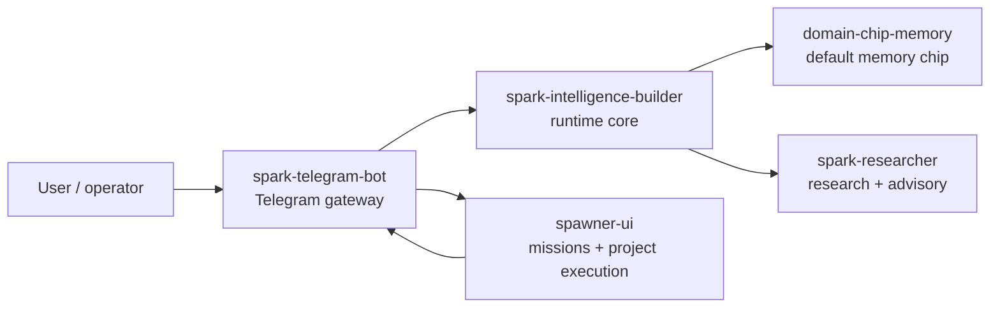

# Spark Intelligence Builder

Spark Intelligence Builder is the runtime core for Spark's personal agent layer. It handles identity, memory routing, provider configuration, operator controls, and contracts into the rest of the Spark ecosystem.

Builder is intentionally not the whole system. Telegram ingress, mission execution, research loops, and memory-chip experiments live in separate repos so each piece stays understandable and replaceable.

## Architecture



Default Spark CLI installs wire this shape automatically:

- `spark-telegram-bot` owns the Telegram token and long polling.
- `spark-intelligence-builder` owns runtime identity, memory routing, and adapter logic.
- `domain-chip-memory` provides the default memory/domain chip.
- `spark-researcher` provides advisory, memory-packet, and chip-authoring flows.
- `spawner-ui` runs missions and project execution.

## Quick Start

Most users should install Builder through Spark CLI:

```bash
spark setup
spark status
```

For local Builder development:

```bash
git clone https://github.com/vibeforge1111/spark-intelligence-builder
cd spark-intelligence-builder
python -m pip install -e .
spark-intelligence status
spark-intelligence doctor
```

Launch healthcheck:

```bash
python -c "import spark_intelligence.cli; print('Spark runtime core is importable.')"
```

## What Builder Owns

- Runtime identity, sessions, pairings, and operator controls.
- Conversation context harness policy: hot-turn preservation, artifact extraction, reference resolution, and compaction budgets used by adapters.
- Provider/auth configuration and health checks.
- Memory bridge behavior used by Telegram and future adapters.
- Contracts for Researcher, domain chips, Swarm, and gateway integrations.
- Bootstrap profiles such as `telegram-agent`.

## What Builder Does Not Own

- Telegram ingress. Launch v1 uses `spark-telegram-bot` long polling.
- Spawner mission state or visual project execution.
- Domain-chip internals or memory benchmark experiments.
- Public webhook hosting for launch v1.
- Raw secret publication. API keys should stay in env vars, keychains, or ignored local files.

## Build On Top Of Builder

If you are an agent or developer extending Spark, use these boundaries:

| Goal | Build here? | Preferred path |
|---|---:|---|
| Add runtime/operator behavior | Yes | Add Builder command, config, or bridge logic |
| Add a new memory strategy | No | Put it in a domain chip repo and attach through the chip contract |
| Add Telegram behavior | Usually no | Use `spark-telegram-bot`; Builder can provide runtime responses behind it |
| Add mission/project execution | No | Use `spawner-ui` APIs and mission contracts |
| Add research/advisory behavior | Usually no | Use `spark-researcher`; Builder can call it |
| Add provider/auth support | Yes | Keep keys out of commits and document env/keychain expectations |

Agent checklist:

1. Read `spark.toml` for installer ownership before changing startup behavior.
2. Run `spark-intelligence status` and `spark-intelligence doctor`.
3. Keep integration work contract-shaped: small command, config, manifest, or bridge.
4. Do not copy another repo's internals into Builder.
5. Do not commit `.env`, `.env.*`, local homes, token files, or private benchmark artifacts.

## Common Commands

```bash
spark-intelligence status
spark-intelligence doctor
spark-intelligence connect status
spark-intelligence auth providers
spark-intelligence auth status
spark-intelligence operator review-pairings
spark-intelligence agent inspect
spark-intelligence pairings list
spark-intelligence sessions list
```

Telegram-side bootstrap, when testing Builder manually with any OpenAI-compatible provider:

```bash
spark-intelligence bootstrap telegram-agent \
  --provider custom \
  --api-key-env YOUR_PROVIDER_API_KEY \
  --model your-model-name \
  --base-url https://your-provider.example/v1 \
  --bot-token-env TELEGRAM_BOT_TOKEN
```

This prepares Builder's side of the Telegram runtime. It should not make Builder a second live Telegram receiver when `spark-telegram-bot` owns the gateway.

Provider examples can include OpenAI-compatible APIs such as OpenAI, OpenRouter, Z.AI, MiniMax, or a local compatible gateway. Spark should not require one specific LLM provider.

## Docs To Read Next

Use this README as the entry point. Use deeper docs only when you need a specific contract or implementation detail:

- Current architecture: [docs/ARCHITECTURE.md](./docs/ARCHITECTURE.md)
- Runtime runbook: [docs/RUNTIME_RUNBOOK.md](./docs/RUNTIME_RUNBOOK.md)
- Telegram bridge split: [docs/TELEGRAM_BRIDGE.md](./docs/TELEGRAM_BRIDGE.md)
- Memory contract: [docs/MEMORY_CONTRACT.md](./docs/MEMORY_CONTRACT.md)
- Conversation context harness: [docs/CONVERSATION_CONTEXT_HARNESS_2026-04-29.md](./docs/CONVERSATION_CONTEXT_HARNESS_2026-04-29.md)
- Product shape: [docs/PRD_SPARK_INTELLIGENCE_V1.md](./docs/PRD_SPARK_INTELLIGENCE_V1.md)
- Historical architecture: [docs/ARCHITECTURE_SPARK_INTELLIGENCE_V1.md](./docs/ARCHITECTURE_SPARK_INTELLIGENCE_V1.md)
- Installer contract: [docs/SPARK_INSTALLER_STANDARD_V1_2026-04-22.md](./docs/SPARK_INSTALLER_STANDARD_V1_2026-04-22.md)
- Researcher integration: [docs/SPARK_RESEARCHER_INTEGRATION_CONTRACT_V1.md](./docs/SPARK_RESEARCHER_INTEGRATION_CONTRACT_V1.md)
- Domain chip attachment: [docs/DOMAIN_CHIP_ATTACHMENT_CONTRACT_V1.md](./docs/DOMAIN_CHIP_ATTACHMENT_CONTRACT_V1.md)
- Security doctrine: [docs/SECURITY_DOCTRINE_V1.md](./docs/SECURITY_DOCTRINE_V1.md)

## Memory Validation

Builder can run live validation around the selected memory behavior, but detailed memory benchmark history belongs in the memory docs rather than this README.

Start with:

- [docs/MEMORY_LIVE_VALIDATION_RESULTS_2026-04-11.md](./docs/MEMORY_LIVE_VALIDATION_RESULTS_2026-04-11.md)
- [docs/MEMORY_BENCHMARK_HANDOFF_2026-04-11.md](./docs/MEMORY_BENCHMARK_HANDOFF_2026-04-11.md)

Fast local check:

```powershell
powershell -ExecutionPolicy Bypass -File .\scripts\run_memory_automation_tests.ps1
```

Full validation:

```powershell
powershell -ExecutionPolicy Bypass -File .\scripts\run_memory_validated_full_cycle.ps1
```

## Security Notes

- Use env var names in examples, not literal API keys.
- Keep Telegram gateway tokens in the gateway runtime only.
- Treat old webhook/gateway docs as historical unless they match the launch split above.
- Scrub local paths, secrets, and private memory data before publishing issues or docs.

## License

MIT. See [LICENSE](./LICENSE).

Spark Swarm is AGPL-licensed. Other Spark repos are MIT unless their
LICENSE file says otherwise. Spark Pro hosted services, private corpuses,
brand assets, deployment secrets, and Pro drops are not included in
open-source licenses. Pro drops do not grant redistribution rights unless
a separate written license says so.
