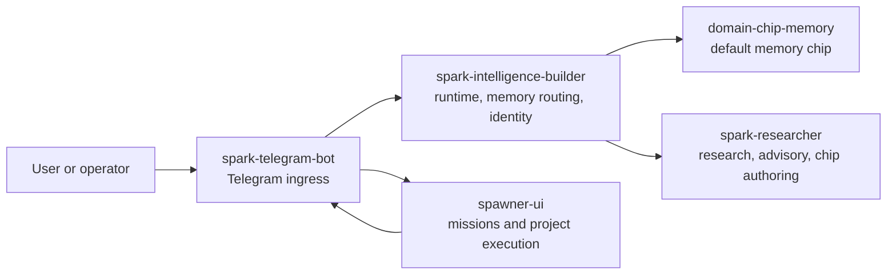

# Spark Intelligence Builder

Spark Intelligence Builder is the runtime core behind Spark's personal agent behavior. It handles identity, memory routing, provider configuration, operator controls, and bridges into the rest of the Spark ecosystem.

It is not meant to absorb every Spark subsystem. Research, memory chips, Telegram ingress, and mission execution each live in their own repos so they can be installed, tested, and improved independently.

## Where It Fits



In the default Spark CLI starter install:

- `spark-telegram-bot` owns the Telegram bot token and long-polling gateway.
- `spark-intelligence-builder` provides the runtime/memory bridge behind the bot.
- `domain-chip-memory` is activated as the default memory chip when discoverable.
- `spark-researcher` provides advisory, research, and chip-authoring flows.
- `spawner-ui` handles missions, projects, and visual execution.

## What Builder Owns

- Persistent Spark runtime state and operator-facing configuration.
- Provider/auth configuration and health checks.
- Memory bridge behavior for Telegram and other adapters.
- Runtime contracts for domain chips, researcher, swarm, and future gateways.
- Bootstrap profiles such as `telegram-agent`.

## What Builder Does Not Own

- Telegram ingress or webhook receiving. Launch v1 uses `spark-telegram-bot` long polling.
- Spawner mission state or project execution.
- Domain-chip internals, benchmark runners, or memory-engine experiments.
- Secret publication. API keys should stay in environment variables, keychains, or local ignored files.

## Quick Start

Most users should install Builder through Spark CLI instead of cloning this repo directly:

```bash
spark setup
spark status
```

For local Builder development:

```bash
git clone https://github.com/vibeforge1111/spark-intelligence-builder
cd spark-intelligence-builder
python -m pip install -e .
spark-intelligence setup
spark-intelligence status
spark-intelligence doctor
```

Launch-safe import healthcheck:

```bash
python -c "import spark_intelligence.cli; print('Spark runtime core is importable.')"
```

## Telegram Bootstrap

Builder can prepare its side of the Telegram agent runtime, but it should not receive the live bot token when `spark-telegram-bot` is the gateway owner.

```bash
spark-intelligence bootstrap telegram-agent \
  --provider custom \
  --api-key-env CUSTOM_API_KEY \
  --model MiniMax-M2.7 \
  --base-url https://api.minimax.io/v1 \
  --bot-token-env TELEGRAM_BOT_TOKEN
```

By default, the bootstrap activates `domain-chip-memory` when it can find the repo. Use `--no-default-memory-chip` only when testing a memory-free runtime.

## Agent Operating Guide

If you are an LLM agent reading this repo:

1. Use `spark-intelligence status` and `spark-intelligence doctor` before making assumptions.
2. Treat `spark.toml` as the installer contract.
3. Keep secrets out of committed docs, logs, fixtures, and command transcripts.
4. Do not add Telegram receivers here for launch v1; use `spark-telegram-bot`.
5. Do not copy memory benchmark internals here; use `domain-chip-memory`.
6. Prefer adding small bridge contracts over merging another repo's ownership into Builder.

## Useful Commands

```bash
spark-intelligence connect status
spark-intelligence operator review-pairings
spark-intelligence auth providers
spark-intelligence auth status
spark-intelligence config set spark.researcher.runtime_root "<workspace>/spark-researcher"
spark-intelligence doctor
spark-intelligence agent inspect
spark-intelligence pairings list
spark-intelligence sessions list
```

## Memory Validation

Builder owns the live validation wrapper that checks whether the selected memory architecture still behaves correctly in the Spark runtime. The current detailed benchmark/eval history lives in the docs, not in this top-level README.

Start here:

- [docs/MEMORY_LIVE_VALIDATION_RESULTS_2026-04-11.md](./docs/MEMORY_LIVE_VALIDATION_RESULTS_2026-04-11.md)
- [docs/MEMORY_BENCHMARK_HANDOFF_2026-04-11.md](./docs/MEMORY_BENCHMARK_HANDOFF_2026-04-11.md)
- [docs/MEMORY_FAILURE_LEDGER_2026-04-11.md](./docs/MEMORY_FAILURE_LEDGER_2026-04-11.md)

Fast local checks:

```powershell
powershell -ExecutionPolicy Bypass -File .\scripts\run_memory_automation_tests.ps1
powershell -ExecutionPolicy Bypass -File .\scripts\run_memory_two_contender_validation.ps1
```

Full validation:

```powershell
powershell -ExecutionPolicy Bypass -File .\scripts\run_memory_validated_full_cycle.ps1
```

## Documentation Map

- Product and architecture:
  - [docs/PRD_SPARK_INTELLIGENCE_V1.md](./docs/PRD_SPARK_INTELLIGENCE_V1.md)
  - [docs/ARCHITECTURE_SPARK_INTELLIGENCE_V1.md](./docs/ARCHITECTURE_SPARK_INTELLIGENCE_V1.md)
  - [docs/SPARK_INTELLIGENCE_PROMPT_BIBLE.md](./docs/SPARK_INTELLIGENCE_PROMPT_BIBLE.md)
- Installer and config:
  - [docs/SPARK_INSTALLER_STANDARD_V1_2026-04-22.md](./docs/SPARK_INSTALLER_STANDARD_V1_2026-04-22.md)
  - [docs/ONBOARDING_CLI_SPEC_V1.md](./docs/ONBOARDING_CLI_SPEC_V1.md)
  - [docs/CONFIG_AND_STATE_SCHEMA_SPEC_V1.md](./docs/CONFIG_AND_STATE_SCHEMA_SPEC_V1.md)
  - [docs/PROVIDER_AND_AUTH_CONFIG_SPEC_V1.md](./docs/PROVIDER_AND_AUTH_CONFIG_SPEC_V1.md)
- Contracts:
  - [docs/SPARK_RESEARCHER_INTEGRATION_CONTRACT_V1.md](./docs/SPARK_RESEARCHER_INTEGRATION_CONTRACT_V1.md)
  - [docs/DOMAIN_CHIP_ATTACHMENT_CONTRACT_V1.md](./docs/DOMAIN_CHIP_ATTACHMENT_CONTRACT_V1.md)
  - [docs/SPARK_SWARM_ESCALATION_CONTRACT_V1.md](./docs/SPARK_SWARM_ESCALATION_CONTRACT_V1.md)
- Security:
  - [docs/SECURITY_DOCTRINE_V1.md](./docs/SECURITY_DOCTRINE_V1.md)
  - [docs/OPENCLAW_HERMES_SECURITY_HISTORY_ANALYSIS_2026-03-25.md](./docs/OPENCLAW_HERMES_SECURITY_HISTORY_ANALYSIS_2026-03-25.md)

## Security Notes

- Never commit `.env`, `.env.*`, local homes, token files, or benchmark artifacts containing private conversations.
- Keep gateway tokens in the gateway repo/runtime only.
- Use env var references such as `CUSTOM_API_KEY`, not literal API keys, in examples.
- Treat old gateway/webhook docs as historical unless they explicitly match the launch split architecture above.

## License

See the repository license file.
