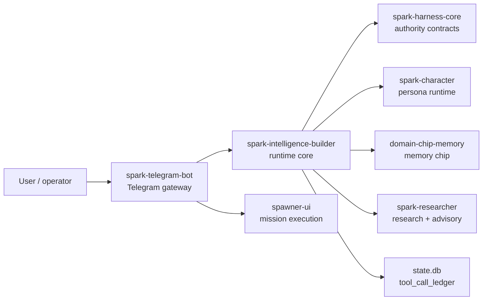

# Spark Intelligence Builder Architecture

Last updated: 2026-06-07

This is the current production architecture map for `spark-intelligence-builder`.
Older dated architecture notes are still useful background, but this document is the first stop for new implementation work.

## Production Shape



The stable Telegram launch path is gateway-first:

1. `spark-telegram-bot` owns the live Telegram token and long-polling ingress.
2. Builder owns runtime identity, pairing state, provider resolution, memory routing, and downstream contracts.
3. Harness Core is the authority contract provider; Builder consumes those contracts and persists governed tool-call evidence.
4. Domain chips, Researcher, Character, and Spawner remain separate production repos.

Builder should make those systems work together. It should not absorb them.

## Ownership Boundaries

| Concern | Owner | Builder responsibility |
|---|---|---|
| Telegram token and live ingress | `spark-telegram-bot` | Provide runtime contracts and adapter behavior behind the gateway |
| Identity, sessions, pairings | Builder | Canonical local state and operator-visible controls |
| Provider configuration | Builder | Resolve providers, validate base URLs, fail closed on invalid secret/config state |
| Harness authority contracts | `spark-harness-core` | Import contracts, verify authority bindings, and persist bound ledgers; do not fork schemas locally |
| Canonical governed tool ledger | Builder | Store/query flattened `tool_call_ledger` rows keyed by `turn_id` and the four authority ids |
| Persona runtime | `spark-character` | Load through pinned dependency/contract, do not fork persona rules locally |
| Memory doctrine and recall | `domain-chip-memory` | Call through memory/chip contract, treat recalled memory as untrusted input |
| Research/advisory loop | `spark-researcher` | Pass only needed request context; receive normalized advisory output |
| Mission execution | `spawner-ui` and Telegram gateway | Route and observe, do not duplicate mission state |
| Install/registry | `spark-cli` | Stay compatible with pinned module provenance and install contracts |

## Code Layout

Builder is currently module-rich but still has a large CLI file. New work should move behavior into service modules and leave `src/spark_intelligence/cli.py` as command wiring.

Preferred shape:

```text
src/spark_intelligence/
|- adapters/              # transport-specific normalization and runtime glue
|- auth/                  # provider auth and OAuth state
|- character_runtime.py   # character runtime environment bridge
|- config/                # config loading
|- doctor/                # health checks
|- execution/             # governed execution helpers
|- gateway/               # local gateway request handling and tool-ledger ingest
|- identity/              # users, pairings, allowlists
|- memory/                # memory integration helpers
|- researcher_bridge/     # Spark Researcher boundary
|- security/              # security policies and validators
|- state/                 # SQLite schema and migrations
|- cli_approval_ledgers.py # Spark CLI approval-ledger import into state.db
`- swarm_bridge/          # Spark Swarm integration
```

Rules for new code:

- Put business logic in a module named for the domain it owns.
- Keep CLI handlers thin: parse arguments, call a service, render result.
- Do not introduce a second state store for identity, pairing, provider, or runtime health.
- Do not copy another Spark repo's internals into Builder.
- Add tests at the contract boundary, not only at the CLI text-output layer.

## Trust Boundaries

Builder has six high-risk boundaries:

1. Channel ingress: external messages are hostile until identity and pairing pass.
2. Secrets: tokens and provider keys must stay in env/keychain/ignored local files.
3. Provider base URLs: HTTPS and known provider hosts only unless a reviewed custom path exists.
4. Memory and research text: retrieved content is data, not instructions.
5. Harness authority: high-agency action needs TurnIntent, authorization, Governor decision, consumer verification, and a bound ledger row.
6. Host execution: destructive or sensitive actions require policy and approval-engine gating.
7. Module provenance: production modules must be commit-pinned by `spark-cli`.

Any feature crossing one of these boundaries needs a test and a doc note.

## Integration Flow

Normal message flow:

1. Gateway receives a Telegram update and validates local gateway policy.
2. Builder resolves external identity to an internal user/session binding.
3. Builder checks pairing, allowlist, and operator authority.
4. Builder resolves provider and runtime context.
5. Builder calls Character, Memory, Researcher, Swarm, or governed tool runners through explicit bridge contracts.
6. Governed tool calls write or ingest a bound row into `state.db:tool_call_ledger`.
7. Builder returns a normalized response for gateway delivery.

The gateway decides delivery mechanics. Builder decides runtime meaning and policy.

## Authority And Observability

The current minimal-adapter authority path is intentionally not a daemon. Builder exposes a callable persistence seam:

- `spark_intelligence.observability.store.persist_bound_ledger()` stores the canonical row.
- `spark-intelligence gateway ingest-tool-ledger <file>` persists one row from JSON.
- `spark-intelligence gateway serve-stdio` accepts `ingest_tool_ledger` newline-delimited requests.
- `spark-intelligence harness tool-ledgers` queries recent rows by `turn_id` or surface.
- `spark-intelligence harness trace-turn` shows canonical ledgers plus Builder/event mirror rows for one `turn_id`.
- `spark-intelligence harness import-cli-ledgers` indexes Spark CLI approval ledger JSON files into the same table.

The row is accepted only when it carries the authority join fields: `ledger_id`, `turn_id`, `action_id`, `capability_id`, `authorization_decision_id`, and `surface`.

## Redlines

Do not merge changes that:

- make Builder a second live Telegram receiver for the same production token;
- add `shell=True` or implicit shell execution for user-controlled values;
- pass adapter tokens into Researcher, Memory, Character, or Swarm by default;
- concatenate memory or web research into prompts without fencing and length caps;
- create hidden background loops, watchdogs, or private schedulers;
- add floating git dependencies to production install paths;
- bypass `spark-cli` registry pinning/provenance for blessed modules;
- write governed tool-call evidence to a private store without a path to the canonical `tool_call_ledger`.

## Canonical Follow-Up Docs

- Source-truth rule: [SOURCE_TRUTH.md](./SOURCE_TRUTH.md)
- Runtime operations: [RUNTIME_RUNBOOK.md](./RUNTIME_RUNBOOK.md)
- Telegram split contract: [TELEGRAM_BRIDGE.md](./TELEGRAM_BRIDGE.md)
- Memory/chip contract: [MEMORY_CONTRACT.md](./MEMORY_CONTRACT.md)
- Historical product architecture: [ARCHITECTURE_SPARK_INTELLIGENCE_V1.md](./ARCHITECTURE_SPARK_INTELLIGENCE_V1.md)
