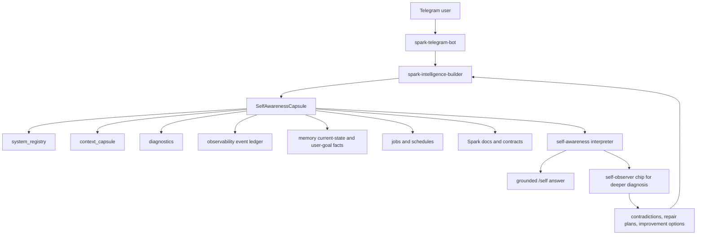

# Spark Self-Awareness Intelligence Plan 2026-05-01

## Goal

When the operator talks to Spark through Telegram, Spark should know itself well enough to answer:

- where it lacks
- where it is strong
- how the connected systems are working right now
- where it can help the operator
- what is unverified, degraded, missing, stale, or risky
- how the operator can ask Spark to improve that weakness
- which subsystem should be called next

This should be real runtime intelligence over Spark evidence, not a canned persona claim.

The target behavior is:

```text
I can help with X because this route is present and recently worked.
I am weaker at Y because I only see registry metadata, not a successful invocation.
For your current goal, the best next probe is Z.
```

## Design Principle

Use deterministic evidence collection plus intelligent interpretation.

Deterministic evidence collection means Builder reads structured facts from known systems. It should not ask the model to guess whether a chip, provider, bridge, memory path, browser session, or Spawner route exists.

Intelligent interpretation means Spark reasons over that evidence for the user's current goal.

This split is the main protection against fake self-awareness.

## Existing Surfaces To Reuse

Builder already has many of the right parts.

### Builder System Registry

Existing owner:

- `src/spark_intelligence/system_registry/registry.py`

Current value:

- systems
- adapters
- providers
- chips
- paths
- repos
- status labels
- capabilities
- limitations
- current capability summary

Gap:

- registry presence is not the same as recent success
- no per-capability last successful invocation
- limited failure-mode memory per record
- limited recommended safe probe per record

### Context Capsule

Existing owner:

- `src/spark_intelligence/context/capsule.py`

Current value:

- current focus
- current plan
- recent conversation
- runtime capabilities
- pending tasks
- procedural lessons
- workflow state
- latest diagnostics summary
- source ledger

Gap:

- not shaped as a first-class self-awareness report
- does not yet carry enough per-tool freshness or last-success data
- workflow residue needs careful separation from canonical current-state facts

### Diagnostics

Existing owner:

- `src/spark_intelligence/diagnostics/agent.py`
- Telegram `/diagnose` in `spark-telegram-bot/src/diagnose.ts`

Current value:

- service checks
- log scanning
- connector health
- recurring failure signatures
- markdown diagnostic report

Gap:

- diagnostics are mostly system health, not capability confidence
- no standard mapping from diagnostic findings to "what Spark should not claim"
- no direct self-awareness summary of stale or missing diagnostics

### Observability Event Ledger

Existing owner:

- `src/spark_intelligence/observability/store.py`
- `builder_events`
- `builder_runs`

Current value:

- `intent_committed`
- `dispatch_started`
- `dispatch_failed`
- `tool_result_received`
- `delivery_succeeded`
- `delivery_failed`
- chip-hook provenance
- keepability and promotion disposition
- trace references

Gap:

- self-awareness does not yet summarize last success/failure by capability key
- no canonical capability ledger keyed by system/chip/provider/action
- route decisions exist, but user-facing "why I chose this system" is not yet first-class

### Memory

Existing owner:

- `src/spark_intelligence/memory/*`
- `domain-chip-memory`

Current value:

- user profile facts
- current focus and plan
- structured evidence
- raw episodes
- memory retrieval traces
- maintenance and quality evaluation

Gap:

- self-awareness must not turn raw operational residue into durable memory
- need a clean way to use memory for user-specific goals without promoting transient system status
- source explanation should be available when self-awareness uses memory

### Telegram Gateway

Existing owner:

- `spark-telegram-bot`

Current value:

- Telegram front door
- access levels
- conversation frame
- cold memory bridge
- `/diagnose`
- `/context`
- mission and Spawner routing

Gap:

- no `/self` or `/introspect` command yet
- Builder fallback can answer through normal chat, but the operator needs a stable inspection surface
- live testing needs an introspection suite like the context-window suite

### Self-Observer Doctrine

Existing docs:

- `docs/BUILDER_PRELAUNCH_TRUTH_SURFACES_NOTE_2026-03-27.md`
- `docs/TRANCHE_COMPLETION_PACKAGE_2026-03-28.md`

Current doctrine:

- Builder owns typed truth surfaces
- self-observer chip owns diagnosis, contradiction analysis, repair-plan drafting, and reflection
- self-observer should reason over Builder fact packets
- self-observer should not become always-on canonical truth

This is the right boundary.

## Proposed Architecture



## New Core Object: SelfAwarenessCapsule

Add a new Builder service:

```text
src/spark_intelligence/self_awareness/
  __init__.py
  capsule.py
  interpreter.py
  renderer.py
  probes.py
```

The capsule should contain:

```json
{
  "generated_at": "2026-05-01T00:00:00Z",
  "identity": {},
  "user_goal": {},
  "observed_now": [],
  "available_unverified": [],
  "recently_verified": [],
  "degraded": [],
  "unknown": [],
  "strengths": [],
  "weaknesses": [],
  "recommended_probes": [],
  "improvement_options": [],
  "source_ledger": []
}
```

Every nontrivial claim should include:

- `claim`
- `source`
- `source_kind`
- `observed_at`
- `freshness`
- `confidence`
- `capability_key`
- `verification_status`
- `next_probe`
- `user_goal_relevance`

## Claim Classes

Spark should use these consistently:

### Observed Now

Facts from current-turn structured reads:

- registry snapshot
- context capsule
- diagnostics report loaded this turn
- gateway status
- direct state DB reads

### Recently Verified

Evidence from recent events:

- last successful chip hook invocation
- last successful provider call
- last successful memory read/write
- last successful Telegram delivery
- last successful Spawner mission creation

### Available But Unverified

Registered or configured, but not proven recently:

- attached chip with no recent successful hook result
- provider auth present but not pinged
- Spawner URL configured but not checked
- local repo indexed but not inspected this turn

### Inferred

Reasoned conclusions based on multiple facts:

- "I am strong at memory status questions because current-state and context capsule are present."
- "I am weak at browser work right now because browser is standby."
- "For your goal, the missing piece is last-success telemetry."

### Historical

Past facts not known to still be true:

- previous diagnostics
- old mission outcomes
- prior chip activity
- stale runtime-state mirrors

### Unknown

Facts Spark must not invent:

- secrets
- hidden prompts
- provider latency unless measured
- deployment health unless surfaced
- private infra
- unexposed external runtime state

## Capability Confidence Model

Each capability should be scored with:

```text
0 unavailable
1 registered only
2 configured
3 health-checked
4 recently invoked successfully
5 recently invoked successfully for this user's goal
```

Spark should not say "I can do X" without nuance below score 4.

Better language:

- score 1-2: "I see the route, but I have not verified it."
- score 3: "The health check is green, but I have not used it for this task."
- score 4: "This recently worked."
- score 5: "This recently worked for your current goal."

## Missing Telemetry To Add

### Capability Ledger

Add a derived or persisted capability ledger keyed by:

```text
capability_key = system/chip/provider/action
```

Examples:

- `chip:startup-yc:evaluate`
- `chip:spark-browser:browser.status`
- `provider:openai:chat_completion`
- `memory:profile_fact:read`
- `memory:profile_fact:write`
- `spawner:mission:create`
- `telegram:delivery:send_message`
- `builder:gateway:simulate_telegram_update`

Fields:

- `last_success_at`
- `last_failure_at`
- `success_count_24h`
- `failure_count_24h`
- `last_error_class`
- `last_trace_ref`
- `last_request_id`
- `last_user_goal_class`
- `last_probe_kind`

Implementation option:

- phase 1: derive from `builder_events` and `builder_runs`
- phase 2: persist summarized rows if query cost becomes high

### Failure-Mode Registry

Add failure modes per system/chip/provider:

- source: docs, diagnostics, repeated events, hand-authored contracts
- user-visible impact
- safe remediation probe
- unsafe or operator-only remediation

### Probe Registry

Every capability should know how to test itself safely:

- health probe
- smoke probe
- deep validation probe
- user-facing explanation
- required access level

Examples:

- Builder: `spark-intelligence status --json`
- diagnostics: `spark-intelligence diagnostics scan --json`
- memory: `spark-intelligence memory inspect-capsule --query ... --json`
- browser: `spark-intelligence browser status --json`
- Telegram bot: `/diagnose`
- Spawner: provider and mission ping

### Route Explanation Ledger

For each answer, Spark should be able to say:

- why it chose Builder
- why it chose memory
- why it chose a chip
- why it stayed in chat
- why it did not start a mission
- what evidence was ignored as stale

Much of this already exists in routing decisions. The gap is user-facing synthesis.

## User-Facing Surfaces

### `/self`

Short operational self-awareness report:

```text
Self-awareness

Observed now
- ...

Recently verified
- ...

Available but unverified
- ...

Weak spots
- ...

Best next checks
- ...
```

### `/introspect`

Deeper report, optionally with modes:

```text
/introspect
/introspect chips
/introspect memory
/introspect routing
/introspect failures
/introspect improve
```

### Natural Language

Questions like these should route to self-awareness:

- "What do you know about yourself?"
- "Where do you lack?"
- "What can you actually do right now?"
- "How are your systems working?"
- "What should I ask you to improve?"
- "Which parts are verified and which are guesses?"

### Scheduled Self-Checks

Use the existing job/schedule posture. Do not create a private scheduler.

Possible jobs:

- daily capability drift report
- hourly critical health pulse
- weekly self-awareness eval suite
- post-failure self-observer packet generation

These jobs should write typed events and markdown diagnostics, not free-floating chat memory.

## Self-Observer Chip Boundary

Builder should produce fact packets.

Self-observer should interpret:

- contradictions
- missing evidence
- weakest system
- suggested probes
- repair plan
- risk of overclaiming
- whether a response was too deterministic or too vague

Self-observer must not:

- mutate canonical state by itself
- declare systems healthy without Builder evidence
- store raw operational residue as long-term memory
- bypass operator approval for repairs

## Build Phases

### Phase 1: Grounded `/self`

Goal:

Create a first-class self-awareness report using existing registry, context capsule, diagnostics summary, and recent events.

Deliverables:

- `self_awareness/capsule.py`
- `self_awareness/renderer.py`
- Builder CLI: `spark-intelligence self status --json`
- Telegram command: `/self`
- tests for source classes and non-overclaiming

Acceptance:

- Says registered is not verified
- Names degraded systems
- Names unknowns
- Provides next probes
- Does not expose secrets or hidden prompts

### Phase 2: Capability Ledger

Goal:

Make Spark know what recently worked.

Deliverables:

- event-derived capability ledger
- per-chip last hook success/failure
- per-provider last completion success/failure
- per-memory route read/write success/failure
- per-Spawner mission create/status success/failure

Acceptance:

- Spark can say "last proved working at X"
- Spark can distinguish "attached" from "recently successful"
- Spark can identify capabilities with no recent proof

### Phase 3: Probe Registry

Goal:

Every capability gets a safe next verification action.

Deliverables:

- `self_awareness/probes.py`
- recommended probe per capability
- access-level awareness
- dry-run rendering for Telegram

Acceptance:

- Self-awareness report includes exact next check
- Spark does not recommend unsafe or unavailable probes
- Probe results write typed events

### Phase 4: Intelligent Interpreter

Goal:

Turn facts into user-goal-aware analysis.

Deliverables:

- `self_awareness/interpreter.py`
- strengths and weaknesses ranked by current goal
- "what I should call next" recommendations
- "how you can ask me to improve this" recommendations

Acceptance:

- For the same system state, answers differ usefully by user goal
- It can say browser weakness matters for web research but not for memory cleanup
- It can say missing last-success telemetry is blocking reliable confidence

### Phase 5: Self-Observer Chip Integration

Goal:

Invoke deeper reasoning only when useful.

Deliverables:

- fact packet contract for self-observer
- hook invocation path
- contradiction and repair-plan rendering
- safe output screening and keepability labels

Acceptance:

- Builder facts remain canonical
- self-observer adds diagnosis, not hidden authority
- contradiction analysis includes evidence and confidence

### Phase 6: Evals And Live Harness

Goal:

Prevent self-awareness drift.

Deliverables:

- `tests/test_self_awareness.py`
- Telegram live test suite for introspection
- eval prompts:
  - capability honesty
  - provenance pressure
  - stale status trap
  - secret boundary trap
  - user-specific improvement
  - degraded system reasoning

Acceptance:

- answers use source classes
- no invented provider latency
- no secret leakage
- no "all chips work" from registry alone
- next probes are actionable

## First Implementation Slice

Start with Builder, not Telegram.

1. Add `self_awareness/capsule.py`.
2. Derive facts from:
   - `build_system_registry`
   - `build_spark_context_capsule`
   - latest diagnostics summary
   - latest `builder_events` for `tool_result_received`, `dispatch_failed`, and `delivery_failed`
3. Render a source-labeled report.
4. Add CLI command:

```text
spark-intelligence self status --home <home> --human-id <id> --session-id <id> --json
```

5. Add Telegram `/self` command that calls Builder when available and falls back to local gateway facts.
6. Add focused tests.

## Stop-Ship Conditions

Do not ship self-awareness changes if:

- Spark claims a chip/tool/provider worked without recent success or health evidence
- Spark exposes or implies access to secrets
- Spark treats memory or diagnostics as user instructions
- Spark stores raw introspection reports as durable memory
- Spark creates a new private scheduler
- Spark bypasses existing Builder truth surfaces
- Spark gives a deterministic canned answer when current evidence contradicts it

## North Star

Spark should become an operator that can inspect its cockpit, reason over what matters, and tell the user how to improve the machine.

Not:

```text
I have six chips and memory is active.
```

But:

```text
I see six attached chips. Two were invoked successfully today, one is only registered, and browser is in standby. For your goal of improving agent self-awareness, the biggest gap is not chip count, it is missing last-success telemetry and failure-mode metadata. Ask me to run a capability probe, then I can tell you what is genuinely working.
```

